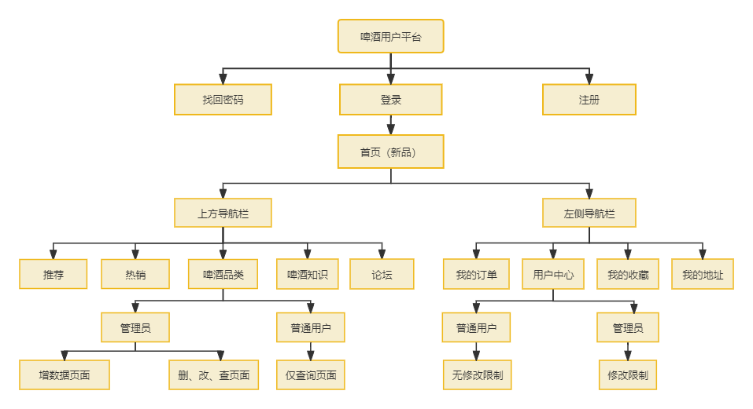

# 啤酒用户平台
- **首页展示**

## 项目介绍
- **功能说明**
啤酒用户平台是针对啤酒行业用户和产品进行管理、销售、知识交流，
提供用户登录、用户注册、用户信息管理、产品信息管理，用户权限管理，
用户行为分析，用户画像等功能的平台。

- **页面组织关系**

- **登录逻辑**

- **管理员新增数据逻辑**

- **数据流示意**

## 项目拆解

### 用户登录

当用户登录时，需要验证用户名和密码，如果验证通过，则进入系统首页；

如果用户不存在，则提示账号不存在，重新输入账号密码或前往注册；

如果密码错误，则提示密码错误，重新输入密码或前往找回密码；

- **登录UI展示**

### 用户注册

用户到达注册页site，需要输入用户名、密码、邮箱、手机号、用户类型，点击注册；

如果注册手机后或邮箱已存在，则提示用户名已存在，重新输入用户名或前往登录；

注册成功后自动跳转到登录页

- **注册UI展示**

### 找回密码

用户到达找回密码页site，需要输入用户名、邮箱、手机号和验证码，点击找回密码；

密码重置成功后立刻跳转到登陆页面；

- **找回密码UI展示**

### 首页
首页设置上导航栏和左侧导航栏，欢迎标语和退出登录按钮

上导航栏模块：首页、推荐、热销、啤酒品类、啤酒知识、论坛

左导航栏模块：用户中心、我的订单、我的收藏、我的地址等

首页展示内容为最新上架的产品；

- **首页UI展示**

### 用户中心
用户中心展示用户的信息，如：用户名、注册手机号、绑定邮箱和用户类型；

需要用户可修改个人信息（非管理员可修改用户类型）；

管理员不可以修改用户类型

- **用户中心UI展示**

### 啤酒品类

啤酒品类展示啤酒的品类，如：青岛啤酒、雪花啤酒、嘉士伯等公司的啤酒产品和产品的相关信息；

消费者和经销商需要可以翻页和搜索；

管理员额外需要可以添加、删除、修改产品信息；（该部分功能对非管理员用户不可见）

- 啤酒品类UI展示

## 技术设计

### 数据库设计
设两张表：用户表、产品表

用户表设计：
- 用户id
- 用户名
- 密码
- 手机号
- 邮箱
- 用户类型
- 用户余额
- 创建时间
- 更新时间

产品表设计：
- 产品id
- 产品名称
- 价格
- 制造商
- 生产原料
- 产品描述
- 创建时间
- 修改时间

### 前端设计：

#### 登录
首先验证账号和密码的规则，当输入完毕时，进行失焦校验，如检验不通过则无法点击登录按钮

如果规则检验通过可以点击登录，触发后端请求，进行数据库搜索，如果账号存在于数据中，且密码正确，那么登录成功跳转到首页；

#### 注册
用户名规则为：只允许输入3-12为的字母和数字；

密码规则：必须为同时包含大写字母、小写字母、数字、特殊字符，且长度为8-16位；

手机号必须符合手机号的规则；

邮箱必须符合邮箱的规则；

用户类型通过下拉框选择，默认消费者；

首先验证账号和密码的规则，当输入完毕时，进行失焦校验，如检验不通过则无法点击注册按钮；

如果规则检验通过可以点击注册，触发后端请求，进行数据库搜索，如果账号不存在，那么注册成功跳转到登录页；

点击注册、且注册成功后，密码通过md5进行加密后存入数据库，用户id通过uuid生成，并存入数据库；初始化用户余额为0；

#### 找回密码

用户输入手机号或邮箱之后，进行失焦校验，如检验不通过则无法点击发送按钮；

如果规则验证通过，需要输入验证码进行验证（验证码规则为随机数转36进制取最后6位）；

验证码验证通过后，输入新密码并确认新密码，新密码规则和注册的密码规则一致；

如果找回密码的账号不存在，则进行提示；

### 后端设计

后端接到前端请求之后，进行在数据库中进行增删改查操作、确保前后端数据的一致性

## 技术栈
Node.js, Vue3, MySQL, 插件/中间件支持：pinia, element-plus, Router, axios, express, cors...

### Node.js

后端服务开发：接收前端请求，连接数据库，返回数据到前端

### Vue3
前端开发：界面开发，数据交互

### MySQL
存储数据，提供数据支持，交互支持

### 插件/中间件支持
pinia：用户数据状态管理，持久化存储

element-plus：前端组件库，提升组件开发效率，增强界面视觉体验

Router：前端路由管理，增强界面交互体验

axios：HTTP请求库，简化HTTP请求，是建立前后端连接的桥梁

express：支持热更新

cors：跨域资源共享，解决跨域问题

## 项目托管
Github：版本管理，代码托管